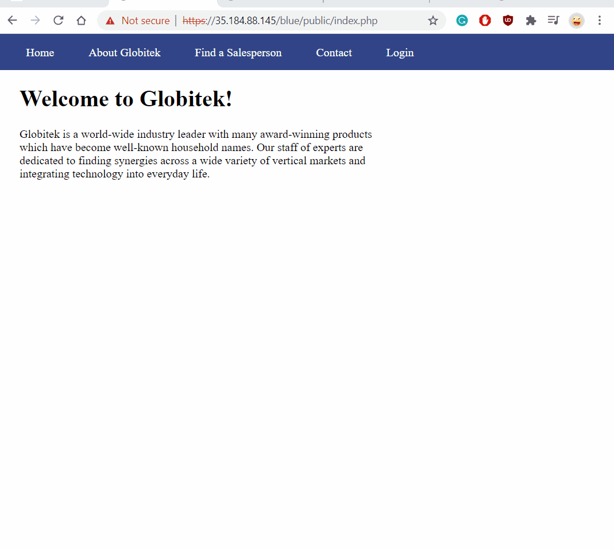
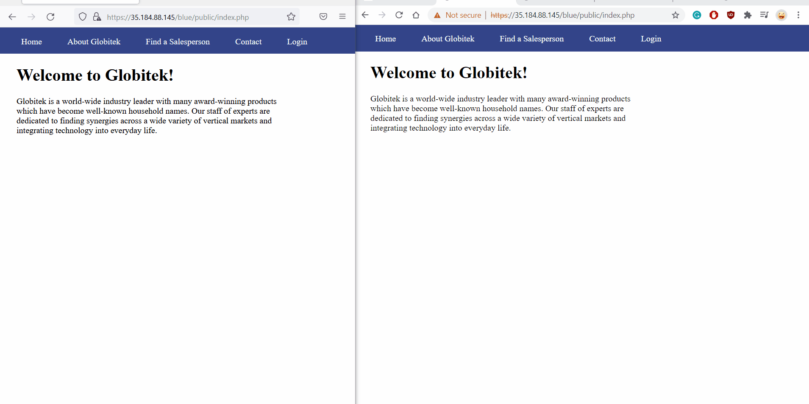
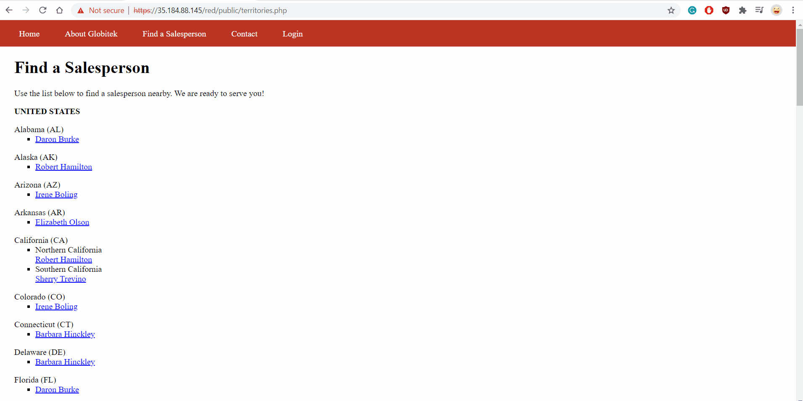
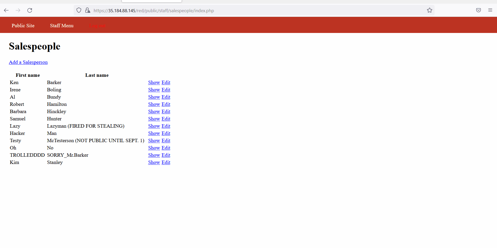
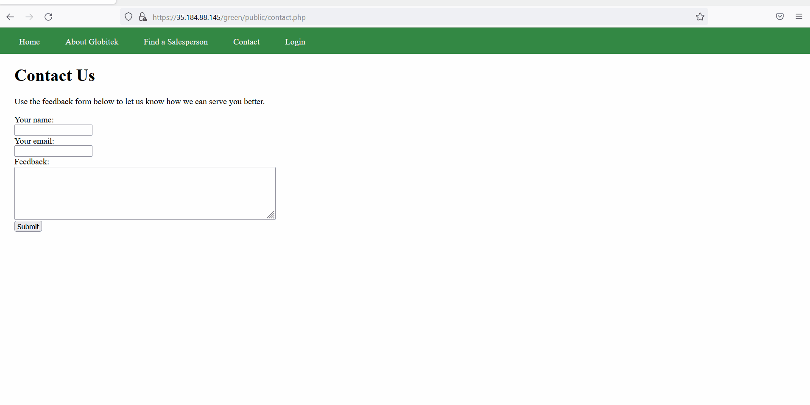
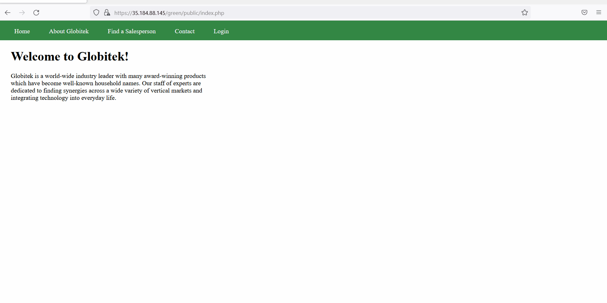

# Week 9 Project: Pentesting Live Targets
### We enumarate two vulnerablilities discovered for each colored site(Blue,Red, and Green) 
## Blue Target:
1.Uses SQL Injection

 
2. Uses Session Hijacking

## Red Target:
1. Uses Insecure Direct Object Reference

2. Uses Cross-Site Request Forgery

## Green Target:
1. Uses Cross-Site Scripting

2. Uses Username Enumeration

